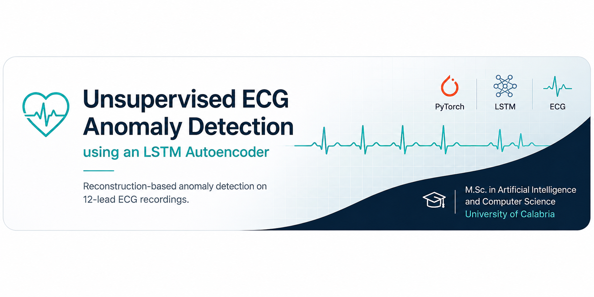
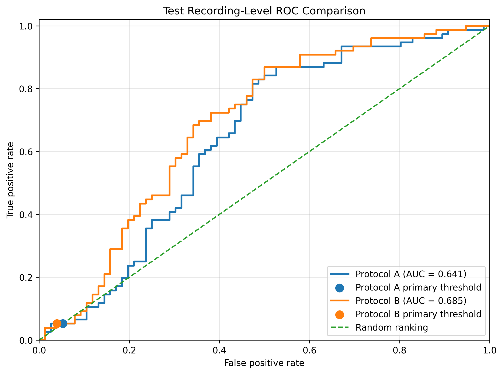

<p align="center">
  
</p>
# Unsupervised ECG Anomaly Detection Using an LSTM Autoencoder


An end-to-end **PyTorch** implementation of a reconstruction-based anomaly detection pipeline for **12-lead ECG recordings** using an **LSTM Autoencoder**.

This project investigates whether an LSTM Autoencoder can identify **Atrial Fibrillation (AF)** through reconstruction error without using diagnostic labels during model optimization.

> **Domain:** AI for Healthcare · Medical Time Series · Deep Learning · Unsupervised Learning  
> **Keywords:** ECG Analysis · Anomaly Detection · LSTM Autoencoder · Biomedical Signal Processing · PyTorch  
> **Project:** M.Sc. in Artificial Intelligence and Computer Science  
> **Institution:** University of Calabria

---

# Overview

Unlike supervised ECG classification, this project approaches AF detection as an **unsupervised anomaly detection** problem.

The model learns temporal representations of ECG signals through reconstruction. During inference, window-level reconstruction errors are aggregated into recording-level anomaly scores, which are subsequently evaluated against the available AF labels.

The implementation adapts a reconstruction-based anomaly detection workflow to the **Georgia ECG dataset** and includes complete preprocessing, training, evaluation, and visualization stages.

---

# Key Features

- End-to-end ECG anomaly detection pipeline
- Recording-level preprocessing and data validation
- Leakage-free train/validation/test partitioning
- Sliding-window ECG representation
- LSTM encoder-decoder autoencoder implemented in PyTorch
- Reconstruction-based anomaly scoring
- Recording-level score aggregation
- Validation-based threshold selection
- Quantitative and qualitative evaluation
- Single-recording inference and visualization

---

# Dataset

This project is based on the **Georgia** subset of the **PhysioNet/Computing in Cardiology Challenge 2020** dataset.

Experiments were conducted on a subset of **3,000 ECG recordings** selected after preprocessing and validation.

The original dataset is publicly available at:

https://physionet.org/content/challenge-2020/1.0.2/

The dataset is **not distributed** with this repository.

---

# Project Pipeline

```text
ECG Recordings
        │
        ▼
Data Validation
        │
        ▼
Recording-Level Split
        │
        ▼
Training-Only Normalization
        │
        ▼
Sliding Window Generation
        │
        ▼
LSTM Autoencoder
        │
        ▼
Window Reconstruction Error
        │
        ▼
Recording-Level Anomaly Score
        │
        ▼
Threshold Selection
        │
        ▼
Performance Evaluation
```

---

# Repository Structure

```text
unsupervised-ecg-anomaly-detection-lstm/
│
├── assets/
│   └── banner.png
│
├── notebooks/
│   └── Unsupervised-ECG-anomaly-detection-lstm.ipynb
│
├── figures/
│   ├── evaluation/
│   ├── inference/
│   └── training/
│
├── docs/
│   └── Project_Report.pdf
│
├── README.md
├── LICENSE
├── requirements.txt
└── .gitignore
```

---

# Installation

Clone the repository:

```bash
git clone https://github.com/yaekobB/unsupervised-ecg-anomaly-detection-lstm.git
cd unsupervised-ecg-anomaly-detection-lstm
```

Create a virtual environment:

```bash
python -m venv .venv
```

### Windows PowerShell

```powershell
.venv\Scripts\Activate.ps1
pip install -r requirements.txt
```

### Linux / macOS

```bash
source .venv/bin/activate
pip install -r requirements.txt
```

---

# Usage

1. Download the Georgia ECG dataset.
2. Configure the dataset path in the notebook.
3. Open:

```text
notebooks/Unsupervised-ECG-anomaly-detection-lstm.ipynb
```

4. Run the notebook sequentially.

---

# Results

The implemented pipeline produces recording-level anomaly scores from ECG reconstructions and supports both quantitative and qualitative evaluation.

A representative ROC comparison on the test set is shown below.



For detailed experimental results, threshold analysis, qualitative reconstructions, and discussion, please refer to the accompanying project report.

---

# Documentation

A detailed description of the methodology, implementation, experimental setup, results, and discussion is available in:

**[Project Report](docs/Project_Report.pdf)**

---

# Future Work

Potential extensions include:

- Transformer Autoencoders
- Variational Autoencoders
- CNN-LSTM architectures
- Self-supervised ECG representation learning
- Explainable AI for anomaly localization
- Evaluation on additional ECG datasets

---

# Disclaimer

This repository is intended for educational and research purposes only.

It is **not** intended for clinical diagnosis or medical decision-making.

---

# License

This project is released under the **MIT License**.

See the [LICENSE](LICENSE) file for details.